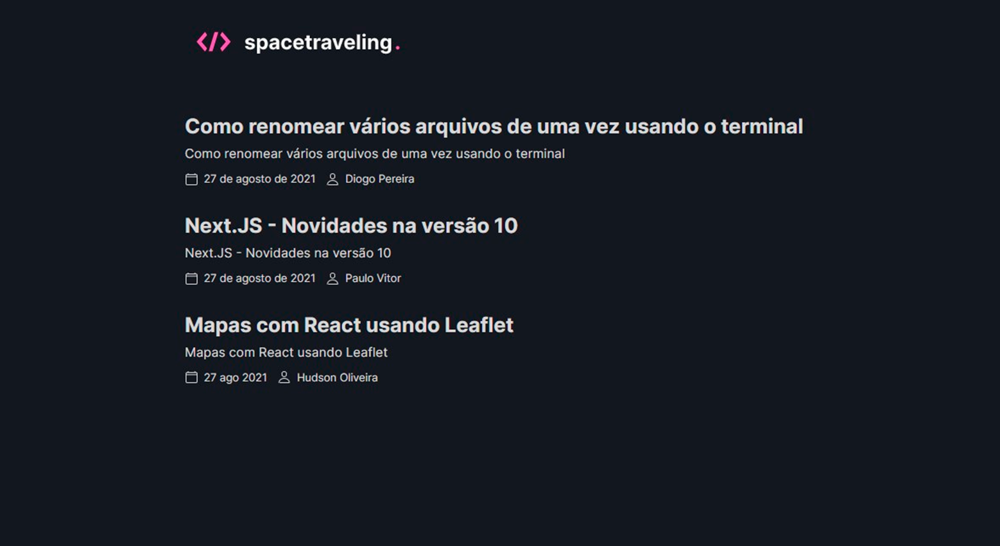

<h2  align="center">

</h2>

  
<p  align="center">
<a  href="#-projeto">Projeto</a>&nbsp;&nbsp;&nbsp;|&nbsp;&nbsp;&nbsp;
<a  href="#-tecnologias">Tecnologias</a>&nbsp;&nbsp;&nbsp;|&nbsp;&nbsp;&nbsp;
<a  href="#-scripts">Scripts</a>&nbsp;&nbsp;&nbsp;|&nbsp;&nbsp;&nbsp;
<a  href="#-licença">Licença</a>
</p>

  

## 💻 Projeto
  

Este projeto é uma aplicação ReactJS NextJS com typescript desafio da rocketseat ignite aplicação space traveling de blog de postagens;
  

## 🧪 Tecnologias


O projeto foi desenvolvido usando as seguintes tecnologias:

  

- [React](https://reactjs.org)

- [Next.js](https://nextjs.org)

- [TypeScript](https://www.typescriptlang.org)

- [CSS Modules](https://github.com/css-modules/css-modules)

- [Prismic](https://prismic.io/)
  

## 📝 Scripts
Instale as dependências.

```bash

$ yarn

```

  
Para executar o projeto rode o comando abaixo.

```bash

$ yarn dev

```


Para realizar o build basta executar o comando abaixo que com o package do next será feito o build.

```bash

$ yarn build

```

    

## 📝 Licença 
 

This project is licensed under the MIT License. See the [LICENSE](LICENSE.md) file for details.

  ---


<p  align="center">Made with 💜 by <a  href="https://github.com/hog099"  target="_blank">Hudson Oliveira</a></p>